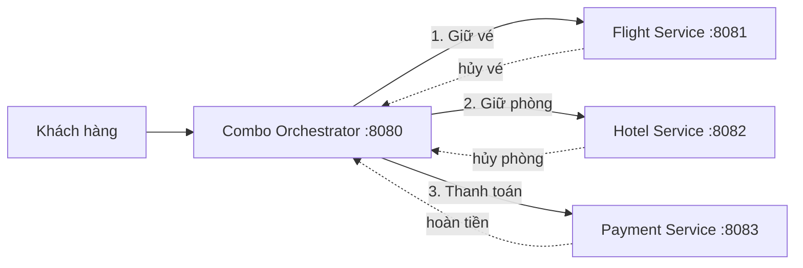

# SS14_HW05 - Hệ thống đặt combo chuyến đi trọn gói

## 1. Bài toán và đầu vào/đầu ra

Khách hàng đặt một combo gồm vé máy bay, phòng khách sạn và thanh toán. Vì ba tài nguyên nằm ở các hệ thống độc lập, giao dịch cơ sở dữ liệu ACID không thể bao trùm toàn bộ. Hệ thống dùng Saga để bảo đảm kết quả cuối cùng là đặt đủ cả ba hoặc bù trừ những bước đã thành công.

Đầu vào gồm `customerId`, `flightCode`, `hotelCode`, `amount` và `scenario` dùng để mô phỏng lỗi. Đầu ra gồm mã combo, trạng thái `CONFIRMED` hoặc `CANCELLED`, mã giữ vé, mã giữ phòng, mã thanh toán và thông báo.

## 2. Lựa chọn Orchestration Saga

Demo chọn **Orchestration** vì luồng có thứ tự rõ ràng, hai đối tác có API và chính sách lỗi khác nhau. Bộ điều phối giữ trạng thái tiến trình, quyết định timeout và gọi bù trừ theo thứ tự ngược. Cách này dễ theo dõi hơn Choreography khi số nhánh lỗi tăng, đổi lại orchestrator là thành phần cần được giám sát và tránh chứa logic nghiệp vụ riêng của đối tác.

## 3. Kiến trúc



Luồng thành công: `PENDING -> FLIGHT_RESERVED -> HOTEL_RESERVED -> PAID -> CONFIRMED`.

Luồng bù trừ:

| Điểm lỗi | Trạng thái đã đạt | Bù trừ |
|---|---|---|
| Hotel từ chối hoặc timeout | Flight đã giữ | Hủy giữ vé, hủy combo |
| Payment thất bại | Flight và Hotel đã giữ | Hủy phòng, hủy vé, hủy combo |
| Lỗi sau thanh toán | Đã thanh toán | Hoàn tiền, hủy phòng, hủy vé |

Các API `cancel` và `refund` được thiết kế idempotent: gọi lặp lại vẫn trả cùng trạng thái cuối, không hủy hoặc hoàn tiền hai lần.

## 4. Timeout, retry và điểm lỗi

- Hotel có timeout 2 giây; lỗi mạng/5xx được thử lại tối đa 2 lần, cách nhau 500 ms.
- Lỗi nghiệp vụ hết phòng (HTTP 422) không retry vì gọi lại ngay không làm phòng xuất hiện.
- Nếu hết retry, orchestrator kích hoạt bù trừ. Trong sản phẩm thật cần lưu Saga state vào database/outbox để tiến trình tiếp tục sau khi orchestrator khởi động lại.
- Những điểm có thể lỗi: đối tác không phản hồi, dữ liệu sai, hết chỗ, thanh toán bị từ chối, lệnh bù trừ tạm thời thất bại và phản hồi trùng.

## 5. Chạy thử

Yêu cầu Java 17. Mở bốn terminal:

```bash
./gradlew :flight-service:bootRun
./gradlew :hotel-service:bootRun
./gradlew :payment-service:bootRun
./gradlew :combo-orchestrator:bootRun
```

Sau đó chạy:

```bash
chmod +x demo/run-scenarios.sh
./demo/run-scenarios.sh
```

Bốn giá trị `scenario` là `SUCCESS`, `HOTEL_FAIL`, `PAYMENT_FAIL`, `HOTEL_TIMEOUT`. Script chính là kịch bản ngắn để quay video demo và lưu lại phản hồi của từng tình huống.

## 6. Giới hạn của bản mô phỏng

Dữ liệu đang lưu trong RAM để tập trung vào Saga. Bản triển khai thật cần database riêng cho từng service, transactional outbox, khóa idempotency bền vững, xác thực API, tracing theo `sagaId` và hàng đợi retry cho lệnh bù trừ.
